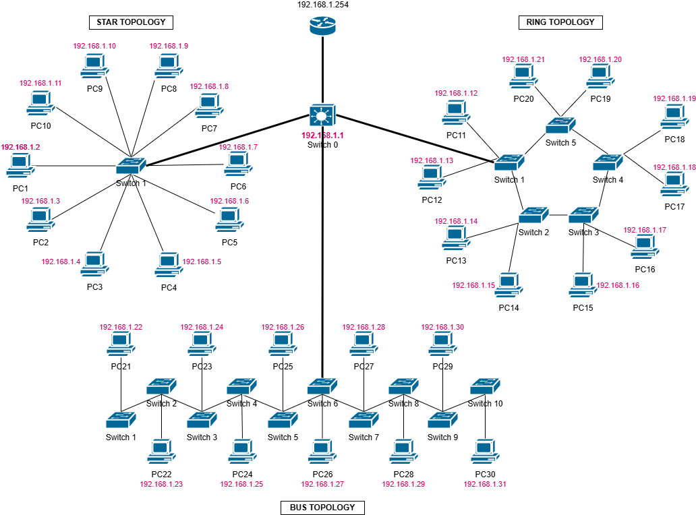

<h1 align="center" style="font-weight: bold;">🌐 Small Network Configuration using Cisco Packet Tracer</h1>

<p align="center">
<a href="#technologies">Technologies</a>
<span>&nbsp; • &nbsp;</span>
<a href="#started">Getting Started</a>
<span>&nbsp; • &nbsp;</span>
<a href="#team">Team Members</a>
</p>

<p align="center">This project showcases a small-scale network configuration using Cisco Packet Tracer, including IP addressing, basic routing, switch configuration, and connectivity testing, along with a visual network design created using draw.io.</p>

<h2 id="layout">🗺️ Network Design Overview</h2>

<div align="center">

<p align="center">Network topology created using draw.io</p>
</div>

<h2 id="technologies">💻 Technologies</h2>

- Cisco Packet Tracer
- Draw.io (for network diagram)
- Git (for version control)

<h2 id="started">🚀 Getting Started</h2>

Follow these steps to explore or modify the network configuration files.

<h3>Prerequisites</h3>

Ensure you have the following installed:

- [Cisco Packet Tracer](https://www.netacad.com/courses/packet-tracer)
- [Git](https://git-scm.com/)

<h3>Cloning</h3>

Clone the project repository:

```bash
git clone hhttps://github.com/Some0ne11/intro-to-networks.git
```

<h3>Files Overview</h3>

- `Section_1_Network_Design.pkt`: Basic network design layout with labeled devices and logical connections.
- `Section2_Device_config.pkt`: Full configuration including IP addressing, VLANs, routing, and interface setup.
- `assets/network-diagram.png`: Visual diagram of the designed network, created with draw.io.

<h3>Usage</h3>

1. Open `.pkt` files with Cisco Packet Tracer.
2. Inspect the topology and verify device configurations.
3. Use simulation mode to test connectivity and observe packet flow.
4. Refer to the diagram for understanding network structure and planning.

<h2 id="team">🤝 Team Members</h2>

<p>Special thanks to all contributors of this project.</p>
<table>
<tr>

<td align="center">
<a href="https://github.com/Some0ne11">
<br>
<sub>
<b>Muhammad Ammar Danial Abdullah</b>
</sub>
</a>
</td>

<td align="center">
<a href="https://github.com/ngxuanhern">
<br>
<sub>
<b>Ng Xuan Hern</b>
</sub>
</a>
</td>

<td align="center">
<a href="https://github.com/L049XEZ">
<br>
<sub>
<b>Low Yvonne</b>
</sub>
</a>
</td>

<td align="center">
<a href="https://github.com/">
<br>
<sub>
<b>Lim Wei Ling</b>
</sub>
</a>
</td>

<td align="center">
<a href="https://github.com/">
<br>
<sub>
<b>Ashman bin Mohd Fauzi</b>
</sub>
</a>
</td>

</tr>
</table>

<p align="center">
🧾 <i>Feel free to fork this repository, explore the configurations, or adapt the design for your own learning.</i>
</p>